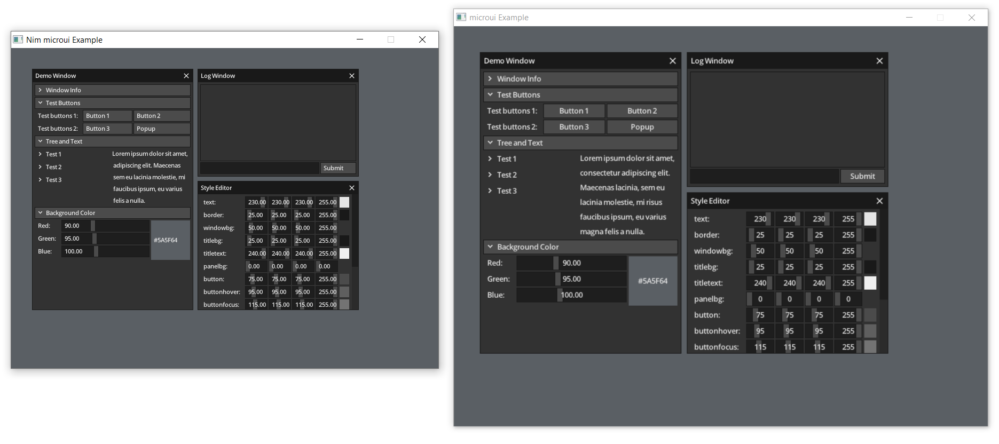

## Example

The example from the original microui project, converted to Nim.

Unlike the original example, which used SDL2, this one uses GLFW for creating the window and managing other properties so there are a few differences between the two but they logically handle about the same.

